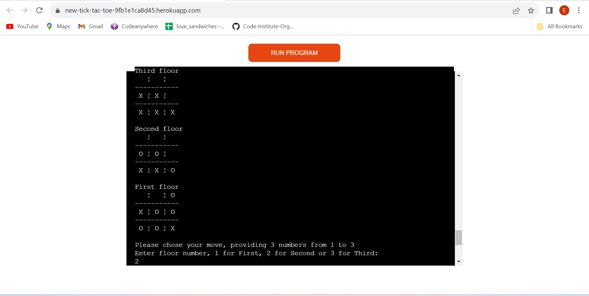
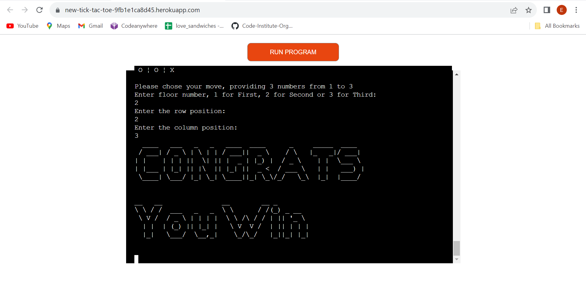
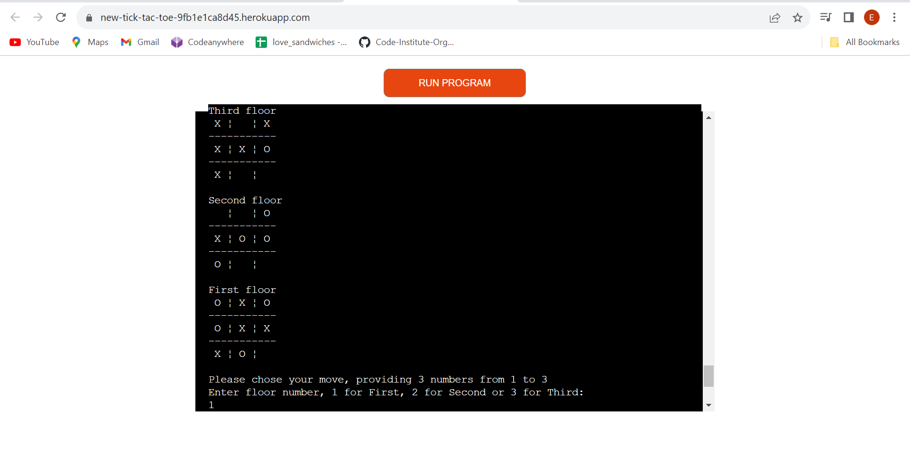
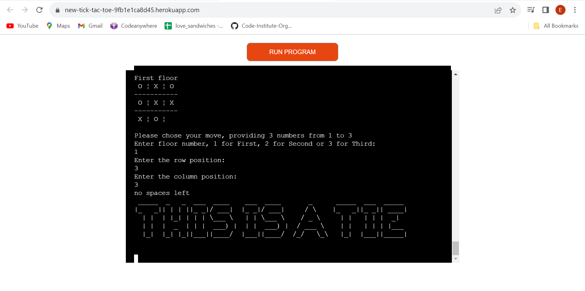
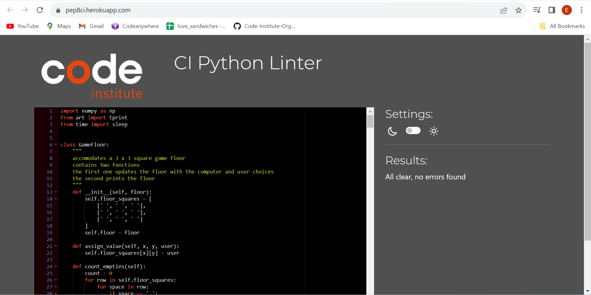

# 3D Tic Tac

3D Tic Tac is a 3D version of the loved tic tac toe game. The game runs in the code institute deployment terminal.
The user will play a game vs the computer, which has been equipped with sufficient intelligence to provide the user with a stimulating challenge.

[You can visit the deployed proyect here](https://new-tick-tac-toe-9fb1e1ca8d45.herokuapp.com/)

## How to play

In this game, the user will battle the machine in three floors simultaneously. Each floor consisting of the original 3 x 3 grid tic tac toe.

The game will start by showing the three floors. The machine will start the game selecting a position in any of the three floors. The user, then will be asked to select a move by giving three numbers, first for the floor, second and third for the row and column in the floor. The computer selection will be marked by 'X', whereas the user position will be marked as 'O'. After a new computer selection, the updated floors will be displayed again. This exchange will continue , until a player wins or a tie is declared. To win, one of two conditions are met by either player:

1. One of the players wins two out of three floors. Winning a floor, requires either player to connect one column, one row or a diagonal. 

2. One of the players connects all three floors by filling the three positions of any vertical line.

On the other hand, a tie will be declared if at a point of the game, there is no possibility for any of the player to fullfil the first option above.

## Features

A menu gives the user the opportunity to choose between instructions or start playing the game.

The selection is done by choosing a number, 1 for instructions or 2 for play. If in the menu selection, no number is provided or the number is not either 1 or 2, an error is displayed giving another chance to provide an appropriate entry.

Instruction how to play the game are complemented with an example to unsdertand how to win and select a move. 

Selecting 2, the game will start with the computer move as shown bellow.

The user moves are taken with 3 entries, each consisting of a number between 1 and 3. Entry errors are handled with the same function used for the menu.

Moves made by the computer are of two kind.

1. Deterministic moves: The algorithm searches for moves to block winning posibilities created by the user, scoring by culminating potential opportunities creating by the computer or generating "attacks" by creating potential opportunities to win by connecting the floors (second option). 

2. Stochastic moves: If deterministic moves are not neccesary at the moment, the algorithm decides for a stochastic option by creating moves using a Bayes-like approach with random likelihood matrices for both, user and computer previous positions. This algorithm is a simple approach to allow the computer learning from the user choices and create a medium level of difficulty, providing an entertaining and challenging experience for the user.

## Data model

Each floor in the program is created as an instance of a class Floor. 
The Floor class is designed to lodge the moves in an 2D array. It contains three functions: (i) assign_values updates the floor with either computer or user moves, count_empties counts the available spaces in the floors arrays and print_floor displays in console the current state of the floor.
This approach will allow easy upgrade to increase the number of floors in the game by creating additional instances of the class Floor.

## Testing

### Menu entry handling

The initial menu is capable to handle exceptions to ensure an appropriate number is entered to choose either instructions of start playing the game as shown below.

### User move entry handling

The error handling of menu was thoroughly tested and showed capable of reject invalid entries.

The same testing was performed for the three neccessary entries for the user move. As seen in the figures below for floor, row and column, respectively, the interface rejects any invalid entry.

The algorithm must also prevent the user from selecting a space already busy as shown in the image below.

### Computer intelligence

On testing, the computer proved being capable to block user opportunities and create winning opportunities. In the image below the computer had blocked the user winning option in the third floor and subsequently created an opportunity to win by connecting vertically all floors. This represents a challenge to the user, since it requires attention to spot this attempts.

In this case, the computer managed to create the vertical option, but also an opportunity to win the second floor by forcing the user to block the vertical "attack", leaving the computer to connect the third row in the second floor.

Further testing proved the computer capacity to win by either:
- option 1 (winning two floors) 

or 

- option two (connecting floors vertically)

The computer gracefully will advice the user they have lost.

### Admitting defeat

The user has a much higher chance to deafeat the computer by winning two floors (option 1) than by a vertical connection of floors (option 2). This is due to the computer algorith to prioritize blocking vertical "attacks". Although the user can use option 2 as a threat to force the computer into a user-favourable move. The image below shows how the user has set up a succesful strategy to win a second floor to conclude the game.

After user making the appropriate move to claim victory the computer immediately admits defeat by the following message:

### Declaring a tie

In this game, a tie is a likely possibility. This will happen if the algorithm finds that there are no options left to win by the first option (winning two floors). This is because at this point, option 2 relies only on a mistake, and the computer will not do that, rendering a non-fair ganme.

The image above shows a tie set-up. After the user choosing the last available spot in the first floor the machine sends a message to indicate a tie.

### PEP8 validator

The python code was validated using the PEP8 validator provided by the code institute. As shown below no errors or problems were found.

## Bugs

No bugs were found during extensive testing of the deployed app.

## Deployment

### GitHub Pages

The project was deployed in the Code Institute's mock terminal for Heroku followin the steps bellow:

1. Fork or clone this repository
2. Create a new Heroku app
3. Set the buildpacks to Python and NodeJS in that order
4. Link the Heroku app to the repository
5. Click on Deploy

### Forking the GitHub Repository

By forking the GitHub Repository we make a copy of the original repository on our GitHub account to view and/or make changes without affecting the original repository by using the following steps...

1. Log in to GitHub and locate the [GitHub Repository](https://github.com/eandablo/differential)
2. At the top of the Repository (not top of page) just above the "Settings" Button on the menu, locate the "Fork" Button.
3. You should now have a copy of the original repository in your GitHub account.

### Making a Local Clone

1. Log in to GitHub and locate the [GitHub Repository](https://github.com/eandablo/differential)
2. Under the repository name, click "Clone or download".
3. To clone the repository using HTTPS, under "Clone with HTTPS", copy the link.
4. Open Git Bash
5. Change the current working directory to the location where you want the cloned directory to be made.
6. Type `git clone`, and then paste the URL you copied in Step 3.

## Credits

- Code Institute for providing the mock template user for this project deployement

- Python code was created by Efren Andablo Reyes

- Acknowldgement to my mentor Dario for his great guidance diring this project development
